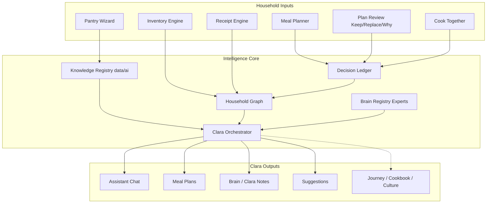

# AI Architecture Map 1.0

**Status:** Master technical map — design before code  
**Initiative:** SOUSCHEF-AI-FOUNDATION-1.0  
**Rule:** One intelligence core. All features plug in here.

---

## System overview



---

## Layer → code mapping

| AI Layer | Primary modules (target) | Today |
|----------|-------------------------|-------|
| **L1 Knowledge** | `data/ai/**`, `knowledge.ts`, `foodTaxonomy.ts` | Taxonomy seed only |
| **L2 Household** | `utils/brain/` v2, graph writers | Brain 1.0A deterministic |
| **L3 Reasoning** | `utils/ai/reasoning.ts`, `meals.ts`, `assistant.ts` | Raw GPT prompts |
| **L4 Skills** | `utils/ai/skills.ts`, Cook Together hooks | Not started |
| **L5 Experience** | `experiences.ts` (future) | Paused |
| **L6 Legacy** | `recipes.ts` + graph tradition nodes | Paused |

---

## Knowledge Registry (`data/ai/`)

```text
data/ai/
├── README.md
├── ingredients/          # Nodes: paprika, chicken, flour…
│   └── paprika.json
├── techniques/             # roux, deglaze, brine…
├── flavor_profiles/        # cajun, umami-forward…
├── substitutions/          # edges: mozzarella → provolone
├── cuisines/               # southern, cajun, italian…
├── food_science/           # maillard, emulsion…
├── nutrition/              # macros, allergens (reference)
├── meal_patterns/          # leftover lunch, easy night…
├── hosting/                # potluck, dinner party timelines
├── culture/                # traditions, holidays
└── traditions/             # legacy templates
```

### Node schema (JSON)

```json
{
  "id": "ingredient.paprika.smoked",
  "type": "ingredient",
  "display_name": "Smoked Paprika",
  "parent_id": "ingredient.paprika",
  "attributes": {
    "variants": ["sweet", "hot", "smoked", "hungarian", "spanish"],
    "flavor_compounds": ["capsaicin", "smoke"],
    "substitutes": ["ingredient.paprika.hot", "ingredient.chili.powder"],
    "pairings": ["ingredient.garlic", "ingredient.tomato"],
    "cuisine_tags": ["spanish", "cajun", "bbq"]
  },
  "sources": ["usda", "curated"]
}
```

**Query API (S2):** `GET /.netlify/functions/knowledge?id=ingredient.paprika`  
**Used by:** Reasoning Engine, substitutions in planner, Clara chat.

---

## Brain Registry (`brainRegistry.ts`)

Clara = **orchestrator**. Experts = **specialized system prompts + tool access + graph slices**.

| Expert ID | Role | Primary graph slice |
|-----------|------|---------------------|
| `executive_chef` | Menu direction, technique | techniques, meal_patterns |
| `sous_chef` | Default Clara voice, coordination | all (orchestrator) |
| `nutritionist` | Dietary, macros, allergens | nutrition, profile |
| `food_scientist` | Why techniques work | food_science |
| `budget_analyst` | Cost, waste, pantry challenge | receipts, inventory |
| `homestead_advisor` | Preservation, garden, batch | culture, meal_patterns |
| `dinner_host` | Events, timelines, scaling | hosting |
| `food_historian` | Tradition, origin, culture | culture, traditions |
| `preservation_expert` | Canning, ferment, freeze | techniques, food_science |
| `flavor_architect` | Pairings, substitutions | flavor_profiles, ingredients |

### Orchestration flow

```text
1. Classify intent (plan · chat · suggest · host · learn)
2. Load household context (graph + ledger + profile)
3. Select 1–3 experts
4. Each expert returns structured recommendation + evidence
5. Orchestrator merges → single Clara voice
6. Write Decision Ledger entry
7. On Keep/Replace → update ledger outcome
```

---

## Decision Ledger

### Schema

```typescript
interface DecisionLedgerEntry {
  id: string;
  household_id: string;
  user_id: string;
  timestamp: string;
  domain: 'meal_plan' | 'chat' | 'suggestion' | 'substitution' | 'hosting';
  recommendation: string;
  why: string;
  evidence: string[];           // graph node ids, memory ids, inventory refs
  confidence: number;             // 0–1
  expert_ids: string[];
  outcome?: 'accepted' | 'rejected' | 'replaced' | 'pending';
  outcome_at?: string;
  outcome_note?: string;
  metadata?: Record<string, unknown>;
}
```

### Write paths (phased)

| Source | Phase | Status |
|--------|-------|--------|
| Meal plan review Keep/Replace | S4 | UI exists, persist next |
| Meal plan generation | S5 | Log plan + coverage + metrics |
| Assistant chat suggestion | S6 | Log actionable replies |
| Substitution picks | S2 | When knowledge API ships |

### Read paths

- Brain 2.0 pattern detection  
- Confidence adjustment on repeated accepts/rejects  
- Clara "Why this?" uses ledger evidence (not hallucination)

---

## Integration: existing features → core

| Feature | Today | After foundation |
|---------|-------|------------------|
| **assistant.ts** | Single system prompt + pantry string | Orchestrator + experts + knowledge lookup |
| **meals.ts** | Chunked GPT + realism rules | Reasoning engine + graph + ledger |
| **brain/** | Deterministic formulas | + graph traversal + ledger feedback |
| **suggestions.ts** | Simple inventory rules | Household intelligence |
| **MealPlanner review** | Local state | Ledger writes → Brain reads |
| **foodTaxonomy.ts** | 8 families | Importer into `data/ai/ingredients/` |
| **Plan metrics** | Rough scores | Graph-backed utilization |

---

## Anti-patterns (do not build)

| ❌ Don't | ✅ Do |
|---------|------|
| New GPT prompt per feature | Route through orchestrator |
| Duplicate ingredient lists in prompts | Query Knowledge Registry |
| Brain 1.0B as separate chat product | Brain 2.0 as graph + ledger reader |
| Journey UI before Skill layer | L4 micro-lessons in data first |
| Dinner Party UI before L5 | hosting/ knowledge + Experience schema |

---

## Data flow: meal plan (target state)

```text
Chef selects coverage + style + cook nights
        ↓
Orchestrator loads: profile, inventory, graph memories, ledger patterns
        ↓
Experts: executive_chef + budget_analyst + flavor_architect
        ↓
Knowledge: substitutions, cuisine nodes, meal_patterns.leftover_lunch
        ↓
Reasoning: 3 directions OR full plan (Chef choice)
        ↓
Generate meals + grouped supply + metrics
        ↓
Ledger: log plan_id, evidence[], confidence
        ↓
Chef: Keep / Replace / Why → ledger outcome
        ↓
Brain 2.0: update household patterns
```

---

## Security & privacy

- Knowledge registry is **global** (non-PII culinary facts)  
- Household graph + ledger are **private per household** (RLS)  
- Experts never log raw PII in evidence — use node ids  
- See `PRIVACY_AND_DATA_POSITIONING_2_0.md`

---

## Success metrics (foundation complete)

| Metric | Target |
|--------|--------|
| Knowledge nodes | ≥200 ingredients/techniques (curated) |
| Substitution queries | <100ms from registry |
| Plan review persist | 100% synced to ledger |
| Reasoning plans | User can pick direction before full plan |
| Ledger → Brain | ≥1 pattern inferred from accept/reject |
| Feature prompts | Zero new raw pantry-string prompts added |

---

## File creation order (coding starts S1)

1. `data/ai/README.md` + 5 seed JSON nodes  
2. `netlify/functions/utils/ai/brainRegistry.ts`  
3. `netlify/functions/utils/ai/decisionLedger.ts` (types + dev store)  
4. `netlify/functions/utils/ai/orchestrator.ts` (shell)  
5. `netlify/functions/knowledge.ts` (read API)  
6. Wire `meals.ts` plan review → ledger  
7. Replace `assistant.ts` prompt with orchestrator (incremental)

---

*One map. One brain. Every feature plugs in.*
